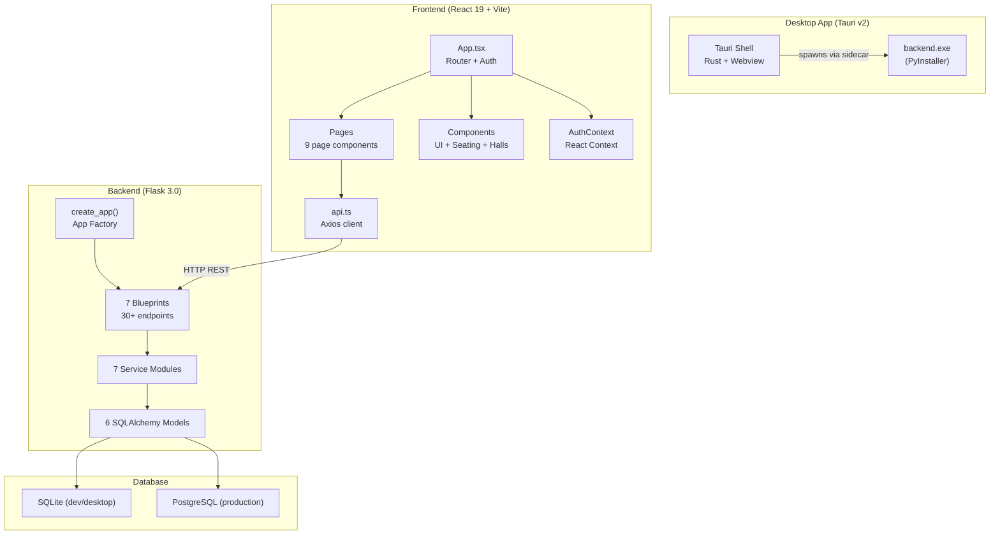
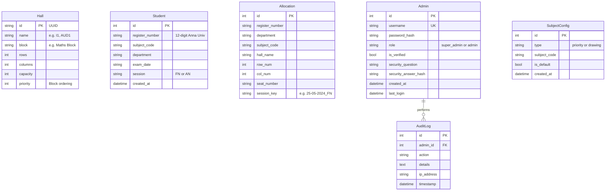
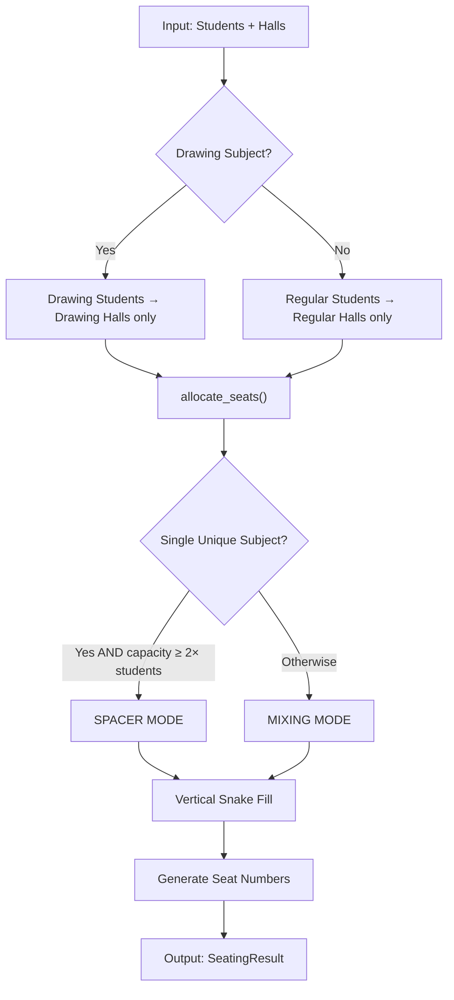
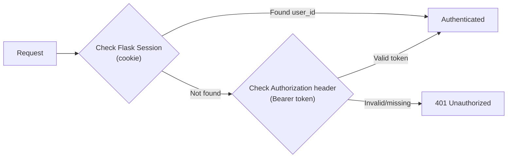
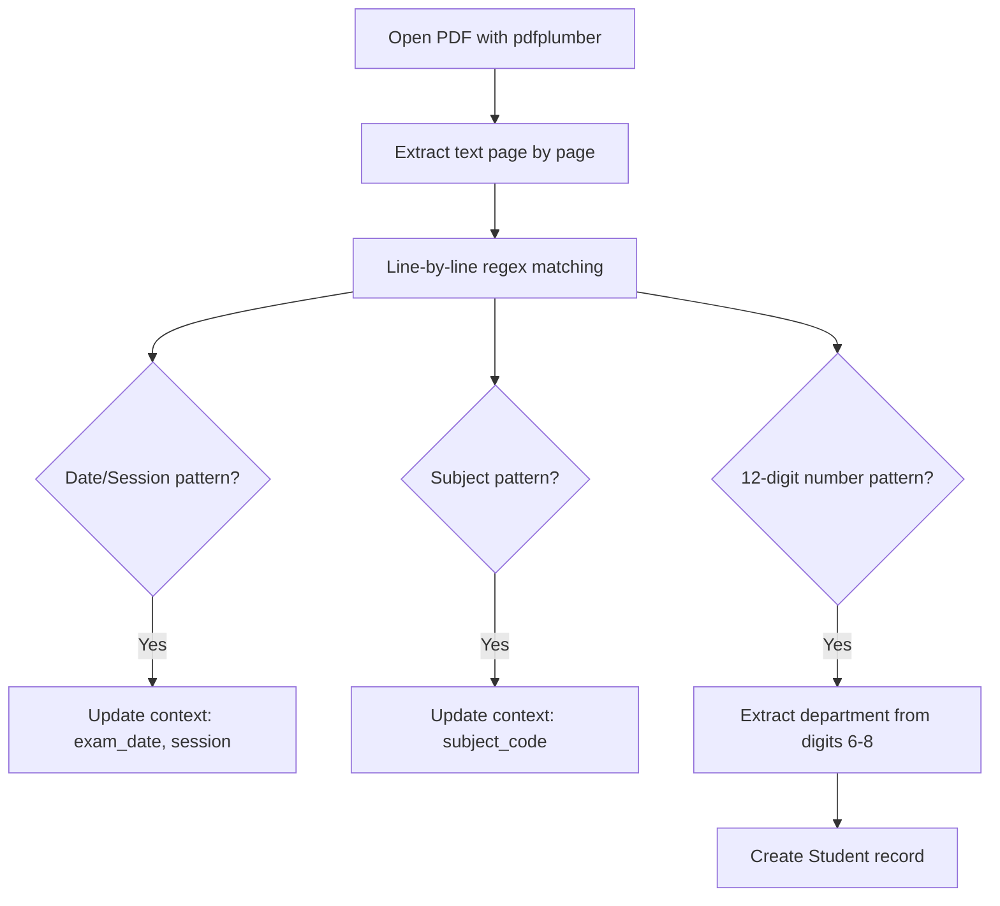
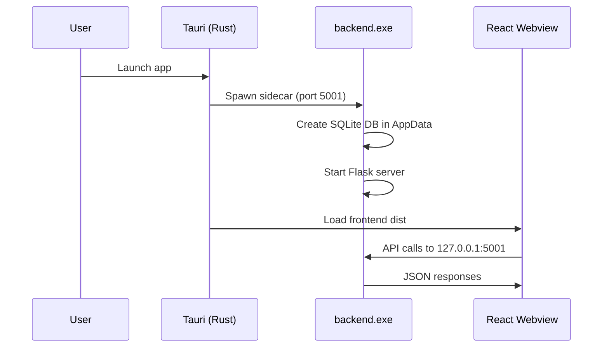
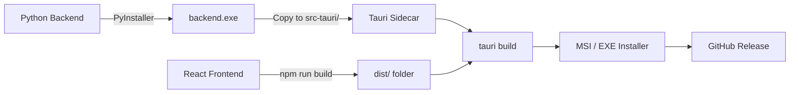

# GCEE Exam Hall Allotment System

<div align="center">


**A full-stack desktop application that automates university exam seating arrangements for Government College of Engineering, Erode (GCEE). Parses student registration PDFs from Anna University, applies an intelligent seating algorithm, and produces formatted Excel reports.**

[⬇️ Download Latest Release](https://github.com/SudarsanamR/Hall-Allocation/releases/latest) · [🌐 Web App](https://gcee-examhall.vercel.app) · [📖 Technical Docs](./Technical%20Documentation.md)

</div>

---

## 📋 Table of Contents

1. [Overview](#-overview)
2. [Key Features](#-key-features)
3. [Technology Stack](#️-technology-stack)
4. [Architecture](#-architecture)
5. [Data Models](#-data-models)
6. [Seating Algorithm](#-seating-algorithm)
7. [REST API Reference](#-rest-api-reference)
8. [Authentication System](#-authentication-system)
9. [PDF Parsing Engine](#-pdf-parsing-engine)
10. [Excel Report Generation](#-excel-report-generation)
11. [Frontend Architecture](#-frontend-architecture)
12. [Tauri Desktop App](#-tauri-desktop-app)
13. [Hall Configuration](#-default-hall-configuration)
14. [Subject Configuration](#-subject-configuration-system)
15. [CI/CD Pipeline](#️-cicd-pipeline)
16. [Security](#-security)
17. [Project Structure](#-project-structure)
18. [Getting Started](#-getting-started)
19. [Environment Variables](#-environment-variables)
20. [Testing](#-testing)
21. [Deployment Modes](#-deployment-modes)

---

## 🎯 Overview

The **GCEE Exam Hall Allotment** system eliminates the manual effort of assigning students to exam halls. It:

- Parses student registration data from Anna University PDFs
- Intelligently groups students by department and subject
- Applies a **Vertical Snake seating pattern** to minimize malpractice
- Generates Excel sheets matching the university's official format
- Provides a **public student portal** to look up seat numbers by registration number

### Deployment Modes

| Mode | Frontend | Backend | Database | Auth |
|------|----------|---------|----------|------|
| **Desktop (Offline)** | Tauri v2 webview | Bundled PyInstaller `.exe` on `127.0.0.1:5001` | SQLite (AppData) | Bearer tokens |
| **Cloud (Production)** | Vercel (`gcee-examhall.vercel.app`) | Render (Gunicorn) | PostgreSQL | Session cookies + CSRF |
| **Development** | Vite dev server (`:1420` or `:5173`) | Flask dev server (`:5001`) | SQLite (local) | Session + Token |

---

## ✨ Key Features

### 🪑 Automated Seat Allotment
- Generates complete seating plans for all exam sessions from a single PDF upload
- **Vertical Snake pattern** fills halls column-by-column in a serpentine sequence to minimize adjacency conflicts
- **Spacer Mode**: inserts empty seats between students when only one subject is present and capacity allows
- **Mixing Mode**: strictly alternates A-B-A-B between two subject groups with smart conflict detection
- Separates **drawing/practical subjects** into dedicated drawing halls automatically

### 🏛️ Hall Management
- Full **CRUD** (Create, Read, Update, Delete) for exam halls
- **Drag-and-drop** interface to reorder hall priority within blocks
- Custom dimensions (Rows × Columns) with auto-calculated capacity
- **Bulk operations**: update capacity or dimensions across multiple halls at once
- One-click reset to 28 default halls across 7 blocks
- Special **9×3 Auditorium** layout with 25-seat cap and XXX-marked unavailable positions

### 📄 PDF Parsing
- Robust extraction of Anna University exam registration PDFs
- Parses: exam date, session (FN/AN), subject codes, and all 12-digit registration numbers
- Auto-extracts department from registration number (positions 6–8)
- Handles multi-page PDFs seamlessly via `pdfplumber`

### 📊 Excel Report Generation
- **Hall-Wise Excel** (4 sheets): SEATING sketch, HALL ALLO summary, NB department breakdown, AUD seating layout
- **Student-Wise Excel**: flat allocation table with auto-filter and frozen header
- Matches official university formatting (Times New Roman, A4, full borders)
- Native **Save As** dialog with exam date pre-filled as default filename

### 🔍 Student Seat Lookup (Public)
- No login required — students enter their 12-digit registration number
- Returns hall name, seat number, and a visual highlighted grid

### 📈 Admin Dashboard
- Real-time stats: total students, halls used, allocated vs. pending seats
- Visual seating grid per hall with department colour coding
- Configurable priority/drawing subject codes
- Custom confirmation modals (no browser alerts)
- Auto-hides PDF upload section once data is already present

### 👥 Role-Based Admin System
- **Super Admin**: manage admin accounts, approve registrations, view audit logs
- **Admin**: upload, generate, manage halls, download reports, configure subjects
- **Unauthenticated**: student search only

---

## 🛠️ Technology Stack

### Backend

| Technology | Version | Purpose |
|---|---|---|
| **Python** | 3.9+ | Core runtime |
| **Flask** | 3.0.0 | Web framework (app factory pattern) |
| **Flask-SQLAlchemy** | 3.1.1 | ORM for PostgreSQL / SQLite |
| **Flask-Migrate** | 4.1.0 | Alembic-based schema migrations |
| **Flask-CORS** | 4.0.0 | Cross-origin requests (Tauri ↔ localhost) |
| **Flask-WTF / CSRFProtect** | 1.2.1 | CSRF protection (production only) |
| **Flask-Limiter** | 3.5.0 | Rate limiting (production only) |
| **Flask-Compress** | 1.17 | Response compression |
| **Werkzeug** | 3.0.1 | Password hashing, ProxyFix, secure filenames |
| **pandas** | 2.1.4 | Data manipulation for student records |
| **pdfplumber** | 0.11.9 | PDF text extraction (Anna University format) |
| **openpyxl** | 3.1.2 | Excel report generation with formatting |
| **Flasgger** | 0.9.7.1 | Swagger API documentation (non-production) |
| **psycopg2-binary** | 2.9.9 | PostgreSQL adapter |
| **Gunicorn** | 21.2.0 | WSGI server (Linux production) |
| **Waitress** | 3.0.0 | WSGI server (Windows) |
| **PyInstaller** | — | Bundles backend into `backend.exe` for Tauri |
| **pytest** | 8.0.0 | Unit testing |

### Frontend

| Technology | Version | Purpose |
|---|---|---|
| **React** | 19.2.0 | UI framework |
| **TypeScript** | ~5.9.3 | Type safety |
| **Vite** | 7.2.4 | Build tool + dev server |
| **Tailwind CSS** | 3.4.19 | Utility-first styling |
| **React Router DOM** | 7.12.0 | Client-side routing |
| **Axios** | 1.13.2 | HTTP client with interceptors |
| **@dnd-kit** | 6.3.1 / 10.0.0 | Drag-and-drop for hall reordering |
| **Lucide React** | 0.562.0 | Icon library |
| **@headlessui/react** | 2.2.9 | Accessible UI primitives |
| **xlsx** | 0.18.5 | Client-side spreadsheet utilities |
| **@fontsource/inter** | 5.2.8 | Typography |
| **@fontsource/space-grotesk** | 5.2.10 | Typography |
| **vite-plugin-pwa** | 1.2.0 | Progressive Web App support |
| **@vercel/analytics** | 1.6.1 | Production analytics |
| **Playwright** | 1.58.1 | E2E testing |

### Desktop (Tauri)

| Technology | Version | Purpose |
|---|---|---|
| **Tauri** | 2.9.5 | Cross-platform desktop framework (Rust + Webview) |
| **Rust** | 1.77.2+ | Tauri runtime |
| **tauri-plugin-shell** | 2.x | Spawn backend sidecar process |
| **tauri-plugin-single-instance** | 2.x | Prevent duplicate app instances |
| **tauri-plugin-log** | 2.x | Desktop logging |

---

## 🏗️ Architecture



---

## 🗄️ Data Models

### SQL Models



### In-Memory Dataclasses (used during seating computation)

| Class | Fields | Purpose |
|-------|--------|---------|
| `Seat` | `row, col, seatNumber, student, subject, department` | One cell in the hall grid |
| `HallSeating` | `hall, grid (2D Seat list), studentsCount` | Complete hall layout |
| `StudentAllocation` | `registerNumber, department, subject, hallName, row, col, seatNumber` | Flat allocation record |
| `SeatingResult` | `totalStudents, hallsUsed, halls, studentAllocation` | Complete session result |

---

## 🧠 Seating Algorithm

> **Source**: `backend/app/services/seating_algorithm.py` (554 lines)

### High-Level Flow



### Strict Subject–Hall Separation

The wrapper `allocate_session_strict()` enforces:
- **Drawing subjects** (e.g., `ME3491`, `GE3251`, `PR8451`) → **Drawing halls only** (`AH1`, `AH2`, `AH3`, `T6A`, `T6B`, `AUD1–4`)
- **Regular subjects** → **Regular halls only**
- Subject classification is admin-configurable via the `SubjectConfig` table

### Grouping Strategy

| Condition | Group By | Rationale |
|-----------|----------|-----------|
| Multiple departments | Department | Separate departments to avoid malpractice |
| Single department | Subject | Separate subjects within same dept |

### Spacer Mode

**Condition**: Only 1 unique subject AND total hall capacity ≥ 2× student count.

**Strategy**: Place students sequentially, inserting an **empty seat (spacer)** after every student.

### Mixing Mode

**Strategy**: Interleave two groups in strict A-B-A-B pattern.

1. Sort groups alphabetically (priority subjects first)
2. Select 2 groups; start with the **larger** group
3. Strictly alternate: A → B → A → ...
4. **Depletion handling**: when one group runs out, replace it with the next available group
5. **Smart tail spacing**: when only 1 group remains, insert spacers if a conflict is detected AND enough capacity remains

### Conflict Detection

Before placing the last-group students, checks:
- **Vertical neighbor** (previous in snake sequence)
- **Horizontal neighbor** (same row, previous column)

If same `subjectCode` or `department` would be adjacent → a spacer is inserted.

### Vertical Snake Fill Pattern

Seats are filled column-by-column in a serpentine pattern:

```
Col 0 (↓)    Col 1 (↑)    Col 2 (↓)    Col 3 (↑)    Col 4 (↓)
  1            10            11           20            21
  2             9            12           19            22
  3             8            13           18            23
  4             7            14           17            24
  5             6            15           16            25
```

**Seat number formula**:
- Even column (down): `seat = (col × rows) + row + 1`
- Odd column (up): `seat = (col × rows) + (rows − row)`

### Student Sorting

Students are sorted by: `(NOT is_priority, department, subjectCode, registerNumber)`.
Priority subjects (databook exams) are placed **first** across all halls.

---

## 📡 REST API Reference

### Blueprint Structure

| Blueprint | Prefix | Auth Required |
|-----------|--------|--------------|
| `auth` | `/api/auth` | Mixed |
| `upload` | `/api` | Admin+ |
| `halls` | `/api` | Admin+ |
| `seating` | `/api` | Mixed |
| `admin` | `/api/admin` | Super Admin |
| `config` | `/api/config` | Admin+ |
| `csrf` | `/api` | None |

### Authentication (`/api/auth`)

| Method | Endpoint | Auth | Description |
|--------|----------|------|-------------|
| `POST` | `/login` | None | Login with username/password. Returns session cookie + Bearer token. |
| `POST` | `/register` | None | Register new admin (requires Super Admin approval). |
| `POST` | `/logout` | Login | Clear session. |
| `GET` | `/me` | Login | Get current authenticated user. |
| `POST` | `/security-task` | None | Get security question for password reset. |
| `POST` | `/reset-password` | None | Reset password via security answer. |
| `POST` | `/change-password` | Login | Change password (requires old password). |
| `PUT` | `/update-profile` | Login | Update username or password. |

### File Upload (`/api`)

| Method | Endpoint | Auth | Description |
|--------|----------|------|-------------|
| `POST` | `/upload` | Admin+ | Upload Anna University PDF. Parses students, clears old data. |
| `GET` | `/students` | Admin+ | Get all parsed student records. |
| `DELETE` | `/reset` | Admin+ | Delete all students and allocations. |

### Halls (`/api`)

| Method | Endpoint | Auth | Description |
|--------|----------|------|-------------|
| `GET` | `/halls` | Login | Get all halls sorted by priority. |
| `POST` | `/halls` | Admin+ | Create a new hall. |
| `PUT` | `/halls/<id>` | Admin+ | Update hall properties. |
| `DELETE` | `/halls/<id>` | Admin+ | Delete a hall. |
| `POST` | `/halls/initialize` | Admin+ | Reset to 28 default halls. |
| `POST` | `/halls/reorder` | Admin+ | Reorder halls within a block (drag-and-drop). |
| `POST` | `/halls/bulk-capacity` | Admin+ | Bulk update hall capacities. |
| `POST` | `/halls/bulk-dimensions` | Admin+ | Bulk update rows/columns (auto-recalculates capacity). |

### Seating (`/api`)

| Method | Endpoint | Auth | Description |
|--------|----------|------|-------------|
| `POST` | `/generate` | Admin+ | Generate seating for all sessions. Clears old allocations. |
| `GET` | `/sessions` | Admin+ | List distinct sessions with allocations. |
| `GET` | `/seating/<session_key>` | Admin+ | Get detailed seating grid for a session. |
| `DELETE` | `/clear` | Admin+ | Clear all allocations and student data. |
| `GET` | `/download/hall-wise` | Admin+ | Download Hall Sketch Excel. |
| `GET` | `/download/student-wise` | Admin+ | Download Student Allocation Excel. |
| `POST` | `/search` | None | Search student allocation by register number. |

### Admin Management (`/api/admin`)

| Method | Endpoint | Auth | Description |
|--------|----------|------|-------------|
| `GET` | `/users` | Super Admin | List all admin users. |
| `PUT` | `/users/<id>/verify` | Super Admin | Approve pending admin registration. |
| `DELETE` | `/users/<id>` | Super Admin | Delete an admin (cannot delete Super Admin). |
| `GET` | `/logs` | Super Admin | Get last 100 audit logs. |
| `DELETE` | `/logs` | Super Admin | Clear all audit logs. |

### Configuration (`/api/config`)

| Method | Endpoint | Auth | Description |
|--------|----------|------|-------------|
| `GET` | `/subjects` | Admin+ | Get all priority + drawing subject codes. |
| `POST` | `/subjects` | Admin+ | Add a new subject code config. |
| `DELETE` | `/subjects/<code>?type=` | Admin+ | Remove a subject code config. |

---

## 🔐 Authentication System

### Dual Auth Strategy



- **Session-based** (production/web): Flask sessions stored in signed cookies
- **Token-based** (desktop/offline): In-memory token store with 24-hour expiry

### Role Hierarchy

| Role | Permissions |
|------|------------|
| `super_admin` | Full access: manage admins, audit logs, all operations |
| `admin` | Upload, generate, manage halls, download reports, configure subjects |
| (unauthenticated) | Student search only |

### Admin Registration Flow

1. New admin registers via `/api/auth/register`
2. Account created with `is_verified = False`
3. Super Admin approves via `/api/admin/users/<id>/verify`
4. Only verified admins can log in

### Password Recovery

Uses **security question/answer** (hashed with Werkzeug):
1. User provides username → receives their security question
2. User answers + sets new password
3. System verifies answer hash and updates password

---

## 📄 PDF Parsing Engine

> **Source**: `backend/app/services/pdf_parser.py`

### Format Expectations

Designed for Anna University exam PDF format:
- **Date/Session line**: `Exam Date: DD-Mon-YYYY / FN|AN`
- **Subject line**: `Subject: CODE:Name  Question Paper Code`
- **Registration numbers**: 12-digit numbers (e.g., `731120104024`)

### Parsing Flow



### Department Extraction

The registration number encodes the degree code at positions 6–8:

| Code | Department |
|------|-----------|
| 102 | AUTO |
| 103 | CIVIL |
| 104 | CSE |
| 105 | EEE |
| 106 | ECE |
| 114 | MECH |
| 159 | CSE(DS) |
| 205 | IT |

---

## 📊 Excel Report Generation

> **Source**: `backend/app/services/excel_generator.py` (505 lines)

### Hall-Wise Excel (Multi-Sheet)

Generates an `.xlsx` file with **4 sheets**:

| Sheet | Content |
|-------|---------|
| **SEATING** | Hall sketches with register numbers + seat numbers in grid format. Includes page breaks every 4 halls. |
| **HALL ALLO** | Summary: hall name, subjects per hall, totals. |
| **NB** | Department-wise breakdown with register number ranges and hall assignments. |
| **aud seating** | Special 3×9 auditorium layout (25 seats, with XXX markers for unavailable positions). |

### Formatting

- **Font**: Times New Roman (10pt data, 12pt titles)
- **Borders**: Full thin borders on all data cells
- **Page setup**: A4 portrait, fit to width
- Department summary below each hall grid

### Student-Wise Excel

A flat table with columns: Registration Number, Subject, Department, Hall, Seat Number, Row, Column. Includes auto-filter and frozen header row.

---

## 🖥️ Frontend Architecture

### Routing Structure

| Route | Component | Auth | Description |
|-------|-----------|------|-------------|
| `/` | `StudentDashboard` | None | Public: search seat by register number |
| `/login` | `Login` | None | Admin login form |
| `/register` | `Register` | None | Admin registration form |
| `/forgot-password` | `ForgotPassword` | None | Security question-based recovery |
| `/admin` | `AdminDashboard` | Admin+ | Upload PDF → Generate → Download |
| `/halls` | `HallManagement` | Admin+ | CRUD + drag-and-drop halls |
| `/super-admin` | `SuperAdminDashboard` | Super Admin | User management + audit logs |

### Component Hierarchy

```
App
├── AuthProvider (React Context)
├── TopBar (navigation + logout)
├── NetworkStatus (connection indicator)
├── ErrorBoundary
└── Routes
    ├── StudentDashboard
    │   └── SeatingGrid (visual hall grid)
    ├── AdminDashboard (657 lines)
    │   ├── Upload (drag-drop PDF)
    │   ├── StatCards (real-time stats)
    │   ├── SeatingGrid (per-hall visualization)
    │   ├── ConfigurableSubjects (priority/drawing config)
    │   └── Filters (dept/subject/block toggles)
    ├── HallManagement
    │   ├── HallCard (per-hall CRUD)
    │   └── DraggableHall (@dnd-kit sortable)
    ├── SuperAdminDashboard
    │   ├── User Management (verify/delete admins)
    │   ├── Audit Logs (action history)
    │   └── Profile Settings
    ├── Login / Register / ForgotPassword
    └── ProtectedRoute (role-based guard)
```

### State Management

- **AuthContext**: Global auth state via React Context API
- **Local state** (`useState`): Per-page state for forms, results, filters
- **No Redux**: Keeps complexity low; API layer handles server sync

### API Layer (`api.ts`)

- **Base URL**: `http://127.0.0.1:5001/api` (offline desktop mode)
- **Axios interceptors**:
  - Auto-retry on CSRF token expiry
  - Dispatch `auth:unauthorized` event on 401
  - Dispatch `network:error` / `network:success` custom events
- **Auth token management**: Stored in-memory, set as `Authorization: Bearer <token>` header

### TypeScript Interfaces

12 interfaces defined: `Hall`, `Student`, `Seat`, `HallSeating`, `SeatingResult`, `StudentAllocation`, `AdminUser`, `AuditLog`, `UploadFileResponse`, `HallFormData`, `AuthResponse`, `SecurityQuestionResponse`.

---

## 💻 Tauri Desktop App

### How It Works

The Tauri app bundles:
1. **Frontend**: Compiled React app (`dist/`) served in a native webview
2. **Backend**: `backend.exe` (PyInstaller bundle of `desktop_server.py`) as a sidecar



### Desktop Server (`desktop_server.py`)

Key behaviors:
- **AppData directory**: `%APPDATA%/GCEE Exam Hall Allotment/` (Windows) — stores `app.db`, logs, uploads
- **SQLite database**: `DATABASE_URL=sqlite:///path/to/app.db`
- **Signal handling**: Graceful shutdown on `SIGINT`/`SIGBREAK`
- **Logging**: Redirects stdout/stderr to log files in AppData

### Tauri Configuration

| Setting | Value |
|---------|-------|
| Product Name | `GCEE Exam Hall Allotment` |
| Identifier | `com.gcee.hallallocation` |
| Window Size | 800 × 600, resizable |
| CSP | Allows `connect-src` to `localhost:5001` and `127.0.0.1:5001` |
| External Binary | `backend` (sidecar) |
| Updater | Configured with GitHub Releases endpoint |

### Tauri Plugins

| Plugin | Purpose |
|--------|---------|
| `tauri-plugin-shell` | Spawn/manage the backend.exe sidecar process |
| `tauri-plugin-single-instance` | Prevent multiple app instances |
| `tauri-plugin-log` | Structured logging |

---

## 🏛️ Default Hall Configuration

The system seeds **28 halls** across **7 blocks**:

| Block | Halls | Dimensions | Special |
|-------|-------|-----------|----|
| Maths / 1st Year Block | I1, I2, I5, I6, I7, I8 | 5×5 (25 seats) | — |
| Civil Block | T1, T2, T3, T6A, T6B | 5×5 (25 seats) | T6A, T6B are drawing halls |
| EEE Block | EEE1, EEE2, EEE3 | 5×5 (25 seats) | — |
| ECE Block | CT10, CT11, CT12 | 5×5 (25 seats) | — |
| Mech Block | M2, M3, M6, AH1, AH2, AH3 | 5×5 (25 seats) | AH1–3 are drawing halls |
| Auto Block | A4 | 5×5 (25 seats) | — |
| Auditorium | AUD1, AUD2, AUD3, AUD4 | 9×3 (cap: 25) | Drawing halls; special XXX layout |

Block priority ordering is drag-and-drop configurable.

---

## 📚 Subject Configuration System

### Two Subject Categories

| Category | Purpose | Examples |
|----------|---------|----|
| **Priority (Databook)** | Exams requiring reference books; allocated first | `ME3591`, `CE3601`, `MA3251` |
| **Drawing** | Practical/drawing exams; sent to special halls | `AU3501`, `ME3491`, `GE3251`, `PR8451` |

### Configuration Flow

1. **Seeded on first run**: 41 priority + 8 drawing codes from `subject_service.py`
2. **Admin-editable**: Add/remove via `/api/config/subjects`
3. **Persistent**: Stored in `SubjectConfig` table with `is_default` flag
4. **Synced**: All admin sessions load from DB on login

---

## ⚙️ CI/CD Pipeline

### GitHub Actions Workflows

#### `release.yml` — Production Release
- **Trigger**: Push tag `v*`
- **Steps**: Checkout → Node 20 → Rust stable → `npm install` → Python 3.11 → `pip install` → PyInstaller build → Copy `.exe` to `src-tauri/` → `tauri-apps/tauri-action` → GitHub Release

#### `release-localhost.yml` — Offline-Only Release
- **Trigger**: Push tag `local-v*`
- Same pipeline; release notes include default Super Admin credentials for standalone use

### Build Chain



---

## 🔒 Security

| Measure | Implementation | Mode |
|---------|---------------|------|
| **CSRF Protection** | Flask-WTF CSRFProtect with token in `X-CSRFToken` header | Production only |
| **Password Hashing** | Werkzeug `generate_password_hash` / `check_password_hash` | All |
| **Rate Limiting** | Flask-Limiter (200/day, 50/hour per IP) | Production only |
| **Input Validation** | Max lengths on all auth fields (80 username, 128 password) | All |
| **File Size Limit** | 16 MB max upload | All |
| **Secure Cookies** | `SameSite=None`, `HttpOnly=True`, `Secure=True` | All |
| **CORS** | Restricted origins (Tauri, localhost, Vercel) | All |
| **CSP** | Tauri webview Content-Security-Policy restricting `connect-src` | Desktop |
| **Audit Logging** | Every admin action logged with IP address | All |
| **ProxyFix** | Werkzeug middleware for Render's reverse proxy headers | Production |

---

## 📁 Project Structure

```
antigravity 3.0/
├── .github/workflows/
│   ├── release.yml              # CI/CD for production Tauri builds
│   └── release-localhost.yml    # CI/CD for offline-only builds
├── backend/
│   ├── app/
│   │   ├── __init__.py          # Flask app factory (252 lines)
│   │   ├── config.py            # Config class
│   │   ├── decorators.py        # Auth decorators (session + token)
│   │   ├── extensions.py        # db, compress initialization
│   │   ├── models/
│   │   │   ├── sql.py           # 6 SQLAlchemy models
│   │   │   ├── schemas.py       # Dataclasses for algorithm
│   │   │   └── database.py      # Legacy in-memory DB
│   │   ├── routes/
│   │   │   ├── auth.py          # Authentication (233 lines)
│   │   │   ├── seating.py       # Core seating API (509 lines)
│   │   │   ├── halls.py         # Hall CRUD + reorder (272 lines)
│   │   │   ├── upload.py        # PDF upload handler
│   │   │   ├── admin.py         # User management
│   │   │   ├── config.py        # Subject configuration
│   │   │   └── csrf.py          # CSRF token endpoint
│   │   └── services/
│   │       ├── seating_algorithm.py  # Core algorithm (554 lines)
│   │       ├── excel_generator.py    # Excel reports (505 lines)
│   │       ├── pdf_parser.py         # PDF parsing
│   │       ├── parser.py             # Excel/CSV parsing
│   │       ├── subject_service.py    # Subject config management
│   │       ├── audit.py              # Audit logging
│   │       └── logging_config.py     # Logging utilities
│   ├── desktop_server.py        # Tauri sidecar entry point
│   ├── run.py                   # Development entry point
│   ├── requirements.txt         # Python dependencies
│   └── migrations/              # Alembic migrations
├── frontend/
│   ├── src/
│   │   ├── App.tsx              # Root component + routing
│   │   ├── main.tsx             # React entry point
│   │   ├── context/AuthContext.tsx
│   │   ├── pages/               # 9 page components
│   │   ├── components/          # Reusable UI components
│   │   ├── utils/api.ts         # Axios API layer (395 lines)
│   │   ├── utils/validation.ts  # Input validation
│   │   └── types/index.ts       # TypeScript interfaces (12 types)
│   ├── src-tauri/
│   │   ├── tauri.conf.json      # Tauri config
│   │   ├── Cargo.toml           # Rust dependencies
│   │   └── src/main.rs          # Rust entry point
│   ├── package.json
│   ├── vite.config.ts           # Vite + PWA config
│   ├── tailwind.config.js       # Tailwind customization
│   └── vercel.json              # Vercel deployment config
├── docs/wiki/                   # Documentation
├── Technical Documentation.md   # Full technical reference
└── README.md
```

---

## 🚀 Getting Started

### Prerequisites

| Requirement | Version |
|-------------|---------|
| Node.js | 18+ |
| Python | 3.9+ |
| Rust | 1.77.2+ (for Tauri desktop builds only) |

### 1. Clone the Repository

```bash
git clone https://github.com/SudarsanamR/Hall-Allocation.git
cd Hall-Allocation
```

### 2. Backend Setup

```bash
cd backend
python -m venv venv

# Windows
venv\Scripts\activate

# macOS/Linux
source venv/bin/activate

pip install -r requirements.txt
```

### 3. Frontend Setup

```bash
cd ../frontend
npm install
```

### Running in Development

**Start the Backend** (from `backend/` directory):
```bash
python run.py
# → http://localhost:5001
```

**Start the Frontend** (from `frontend/` directory):
```bash
npm run dev
# → http://localhost:5173
```

### Building the Desktop App (Tauri)

```bash
# 1. Build the backend sidecar
cd backend
pyinstaller desktop_server.py --onefile --name backend
copy dist\backend.exe ..\frontend\src-tauri\

# 2. Build the Tauri app
cd ../frontend
npm run tauri build
# Output: src-tauri/target/release/bundle/
```

---

## 🌐 Environment Variables

### Backend (`.env`)

| Variable | Default | Purpose |
|----------|---------|---------|
| `SECRET_KEY` | Dev fallback key | Flask session signing |
| `SUPER_ADMIN_USERNAME` | `SuperAdmin` | Initial super admin username |
| `SUPER_ADMIN_PASSWORD` | `GCEEAdmin@2026!` | Initial super admin password |
| `FRONTEND_URL` | `https://gcee-examhall.vercel.app` | CORS allowed origin |
| `DATABASE_URL` | `sqlite:///app.db` | Database connection string |
| `FLASK_ENV` | — | Set to `production` to enable security features |
| `RENDER` | — | Auto-set on Render platform |
| `PORT` | `5001` | Server listen port |

### Frontend

| Variable | Value | Purpose |
|----------|-------|---------|
| `VITE_API_URL` (hardcoded) | `http://127.0.0.1:5001/api` | API base URL for desktop mode |

---

## 🧪 Testing

| Layer | Tool | Location |
|-------|------|---------|
| Backend Unit Tests | pytest + pytest-cov | `backend/tests/` |
| Frontend Linting | ESLint + typescript-eslint | `frontend/eslint.config.js` |
| E2E Tests | Playwright | `frontend/e2e-tests/` |

```bash
# Run backend tests
cd backend
pytest

# Run frontend lint
cd frontend
npm run lint

# Run E2E tests
cd frontend
npx playwright test
```

---

## 📦 Deployment Modes

### Desktop (Offline) — Recommended

Download the latest `.exe` installer from [GitHub Releases](https://github.com/SudarsanamR/Hall-Allocation/releases/latest). No internet connection required after installation. The app stores all data in `%APPDATA%/GCEE Exam Hall Allotment/`.

### Cloud (Production)

- **Frontend**: Deployed on [Vercel](https://gcee-examhall.vercel.app) — auto-deploys from `main` branch
- **Backend**: Deployed on [Render](https://render.com) using Gunicorn + PostgreSQL

### PWA Support

The web app is a Progressive Web App. It can be installed from the browser and works offline for previously cached pages. Configured via `vite-plugin-pwa` with auto-update service worker.

---

## 🤝 Contributing

Contributions are welcome! Please:

1. Fork the repository
2. Create a feature branch (`git checkout -b feature/your-feature`)
3. Commit your changes (`git commit -m 'Add your feature'`)
4. Push to the branch (`git push origin feature/your-feature`)
5. Open a Pull Request

---

## 📄 License

This project is licensed under the **MIT License**.

---

<div align="center">
Made with ❤️ for Government College of Engineering, Erode (GCEE)
</div>
