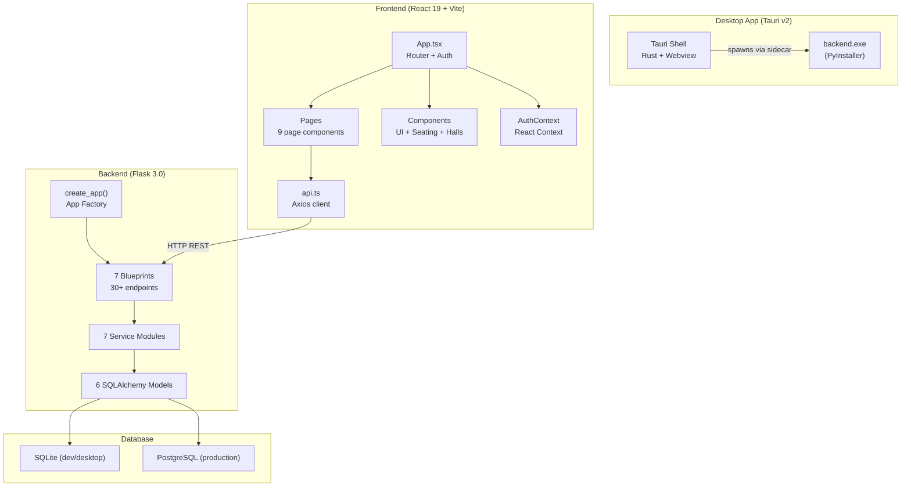
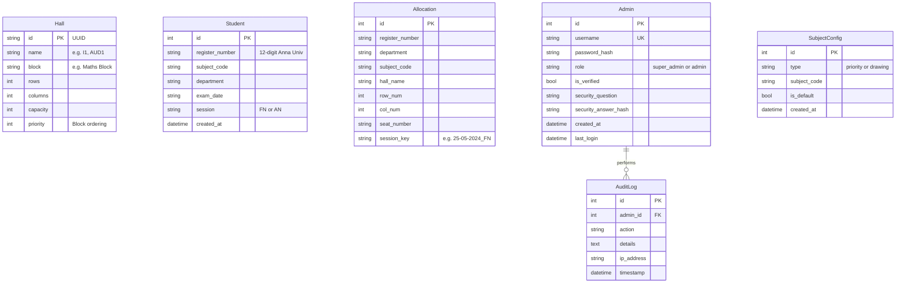
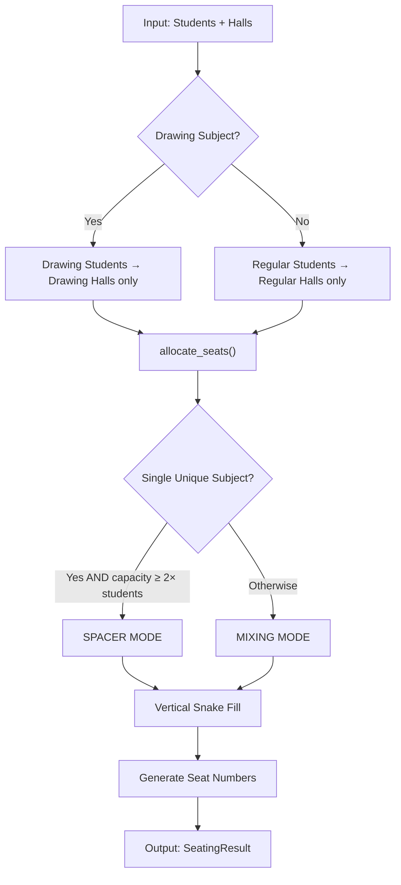
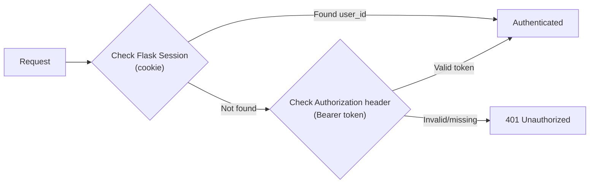
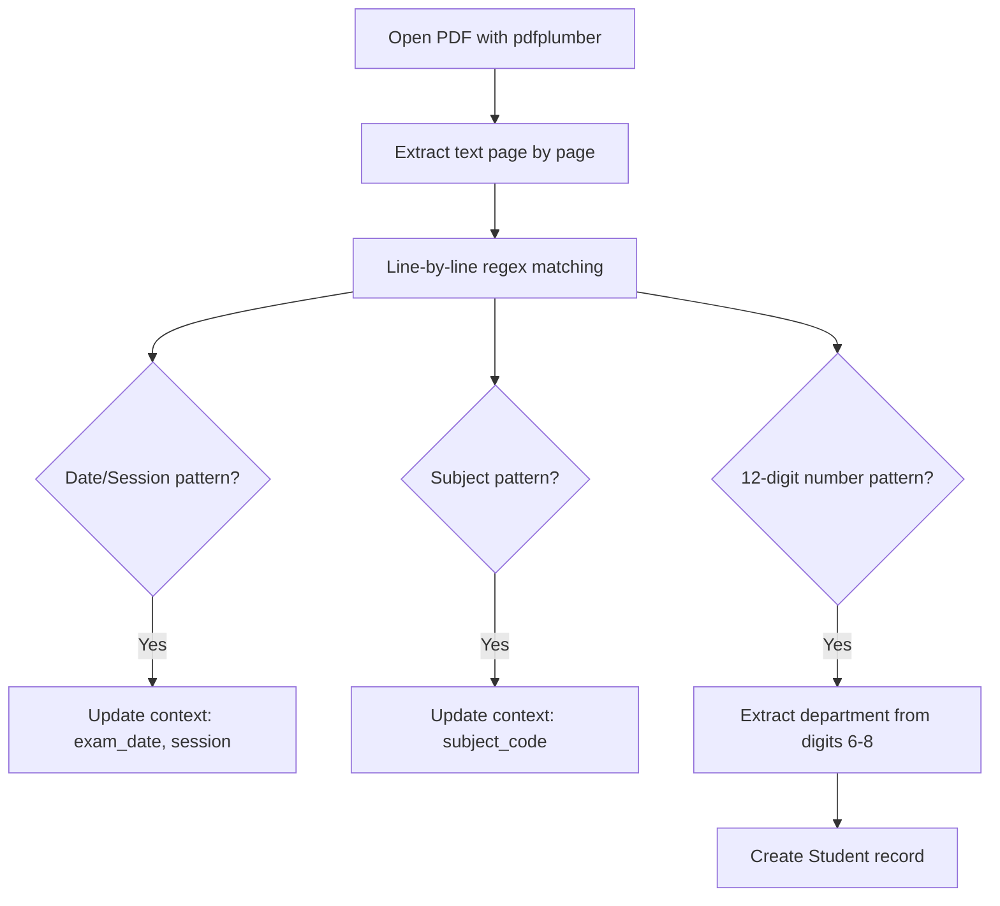
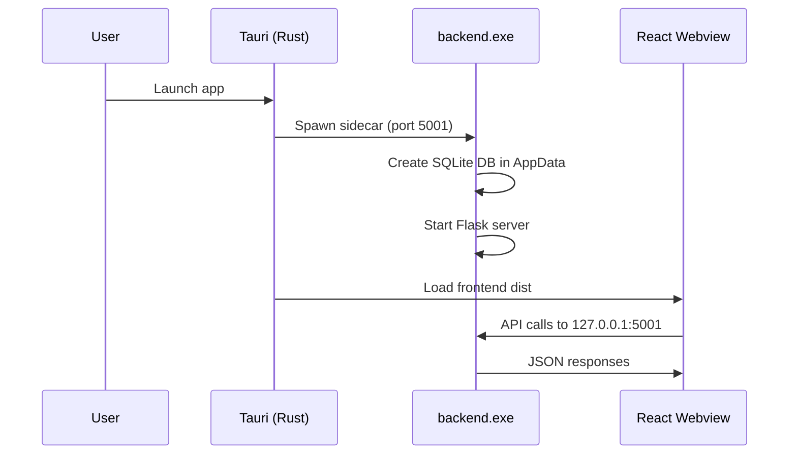
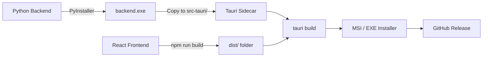
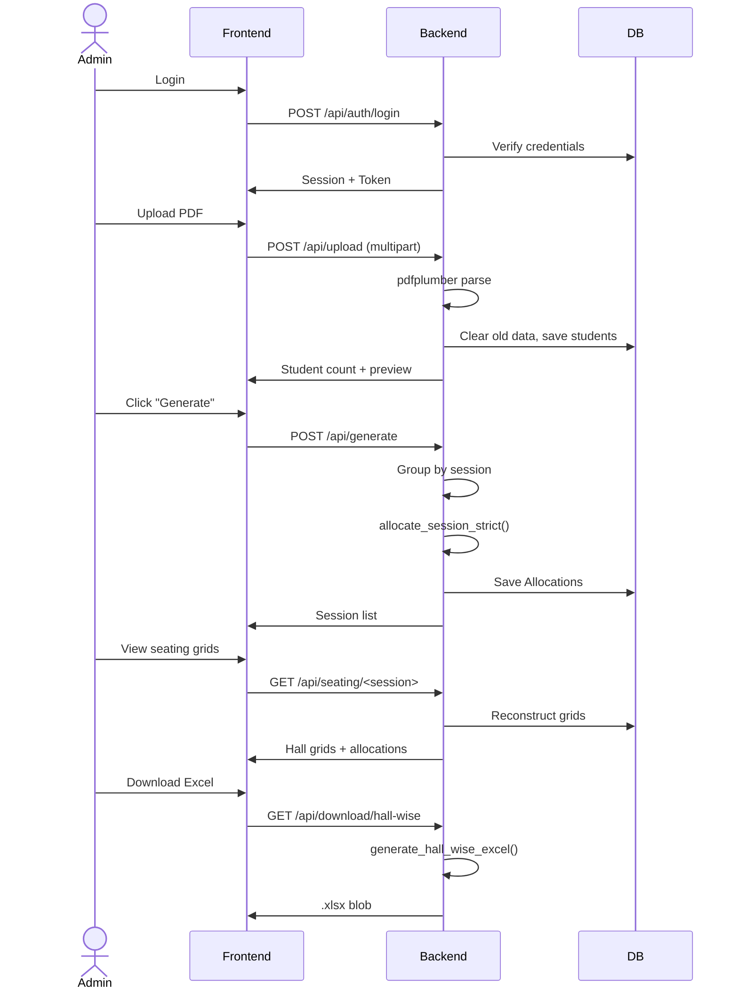
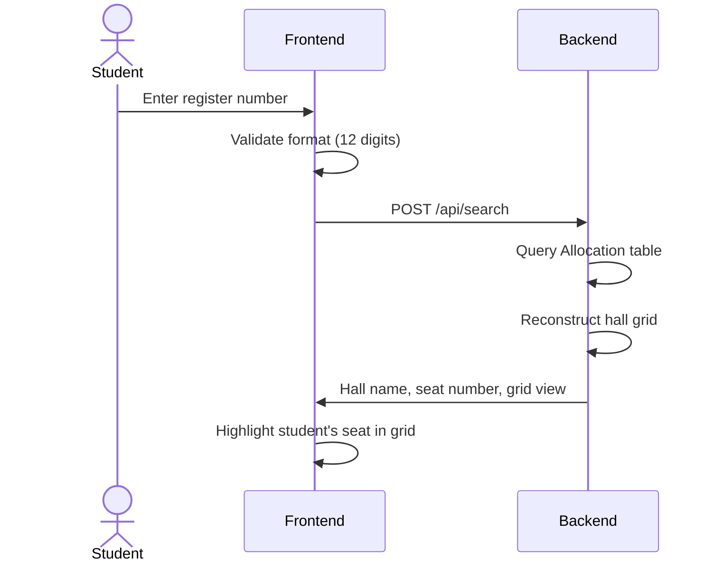

# GCEE University Exam Seat Allotment System — Technical Documentation

> **Version**: 5.0.3 | **Repository**: [SudarsanamR/Hall-Allocation](https://github.com/SudarsanamR/Hall-Allocation)  
> **Last Updated**: March 7, 2026

---

## 1. System Overview

The **GCEE Exam Hall Allotment** system is a full-stack application that automates university exam seating arrangements for **Government College of Engineering, Erode (GCEE)**. It parses student registration PDFs from Anna University, applies an intelligent seating algorithm to assign students to exam halls, and produces Excel reports matching the university's official format.

### Deployment Modes

| Mode | Frontend | Backend | Database | Auth |
|------|----------|---------|----------|------|
| **Cloud (Production)** | Vercel (`gcee-examhall.vercel.app`) | Render (Gunicorn) | PostgreSQL | Session cookies + CSRF |
| **Desktop (Offline)** | Tauri v2 webview | Bundled PyInstaller exe on `127.0.0.1:5001` | SQLite (AppData) | Bearer tokens |
| **Development** | Vite dev server (`:1420` or `:5173`) | Flask dev server (`:5001`) | SQLite (local) | Session + Token |

---

## 2. Architecture Diagram



---

## 3. Technology Stack (Detailed)

### 3.1 Backend

| Technology | Version | Purpose |
|---|---|---|
| **Python** | 3.9+ | Core runtime |
| **Flask** | 3.0.0 | Web framework (app factory pattern) |
| **Flask-SQLAlchemy** | 3.1.1 | ORM for PostgreSQL/SQLite |
| **Flask-Migrate** | 4.1.0 | Alembic-based schema migrations |
| **Flask-CORS** | 4.0.0 | Cross-origin requests (Tauri ↔ localhost) |
| **Flask-WTF / CSRFProtect** | 1.2.1 | CSRF protection (production only) |
| **Flask-Limiter** | 3.5.0 | Rate limiting (production only) |
| **Flask-Compress** | 1.17 | Response compression |
| **Werkzeug** | 3.0.1 | Password hashing, ProxyFix, secure filenames |
| **pandas** | 2.1.4 | Data manipulation for student records |
| **pdfplumber** | 0.11.9 | PDF text extraction (Anna University format) |
| **openpyxl** | 3.1.2 | Excel report generation with formatting |
| **Flasgger** | 0.9.7.1 | Swagger API documentation (non-production) |
| **psycopg2-binary** | 2.9.9 | PostgreSQL adapter |
| **Gunicorn** | 21.2.0 | WSGI server (Linux production) |
| **Waitress** | 3.0.0 | WSGI server (Windows) |
| **PyInstaller** | — | Bundles backend into `backend.exe` for Tauri |
| **pytest** | 8.0.0 | Unit testing |

### 3.2 Frontend

| Technology | Version | Purpose |
|---|---|---|
| **React** | 19.2.0 | UI framework |
| **TypeScript** | ~5.9.3 | Type safety |
| **Vite** | 7.2.4 | Build tool + dev server |
| **Tailwind CSS** | 3.4.19 | Utility-first styling |
| **React Router DOM** | 7.12.0 | Client-side routing |
| **Axios** | 1.13.2 | HTTP client with interceptors |
| **@dnd-kit** | 6.3.1 / 10.0.0 | Drag-and-drop for hall reordering |
| **Lucide React** | 0.562.0 | Icon library |
| **@headlessui/react** | 2.2.9 | Accessible UI primitives |
| **xlsx** | 0.18.5 | Client-side spreadsheet utilities |
| **@fontsource/inter** | 5.2.8 | Typography |
| **@fontsource/space-grotesk** | 5.2.10 | Typography |
| **vite-plugin-pwa** | 1.2.0 | Progressive Web App manifest + service worker |
| **@vercel/analytics** | 1.6.1 | Production analytics |
| **Playwright** | 1.58.1 | E2E testing |

### 3.3 Desktop (Tauri)

| Technology | Version | Purpose |
|---|---|---|
| **Tauri** | 2.9.5 | Cross-platform desktop framework (Rust + Webview) |
| **Rust** | 1.77.2+ | Tauri runtime |
| **tauri-plugin-shell** | 2.x | Spawn backend sidecar process |
| **tauri-plugin-single-instance** | 2.x | Prevent duplicate app instances |
| **tauri-plugin-log** | 2.x | Desktop logging |

---

## 4. Data Models

### 4.1 SQL Models ([sql.py](file:///c:/Users/sudar/Downloads/Projects/University%20Exam%20Seat%20Allotment/antigravity%203.0/backend/app/models/sql.py))



### 4.2 In-Memory Dataclasses ([schemas.py](file:///c:/Users/sudar/Downloads/Projects/University%20Exam%20Seat%20Allotment/antigravity%203.0/backend/app/models/schemas.py))

Used during seating computation:

| Class | Fields | Purpose |
|-------|--------|---------|
| `Seat` | `row, col, seatNumber, student, subject, department` | One cell in the hall grid |
| `HallSeating` | `hall, grid (2D Seat list), studentsCount` | Complete hall layout |
| `StudentAllocation` | `registerNumber, department, subject, hallName, row, col, seatNumber` | Flat allocation record |
| `SeatingResult` | `totalStudents, hallsUsed, halls, studentAllocation` | Complete session result |

---

## 5. Seating Algorithm — Core Logic

> **Source**: [seating_algorithm.py](file:///c:/Users/sudar/Downloads/Projects/University%20Exam%20Seat%20Allotment/antigravity%203.0/backend/app/services/seating_algorithm.py) (554 lines)

### 5.1 High-Level Flow



### 5.2 Strict Subject-Hall Separation

The wrapper function `allocate_session_strict()` enforces:

- **Drawing subjects** (e.g., `ME3491`, `GE3251`, `PR8451`) → **Drawing halls only** (`AH1`, `AH2`, `AH3`, `T6A`, `T6B`, `AUD1-4`)
- **Regular subjects** → **Regular halls only**
- Subject classification is admin-configurable via `SubjectConfig` table

### 5.3 Grouping Strategy

| Condition | Group By | Rationale |
|-----------|----------|-----------|
| Multiple departments | Department | Separate departments to avoid malpractice |
| Single department | Subject | Separate subjects within same dept |

### 5.4 Spacer Mode

**Condition**: Only 1 unique subject AND total hall capacity ≥ 2× student count.

**Strategy**: Place students sequentially, inserting an **empty seat (spacer)** after every student to physically separate them.

### 5.5 Mixing Mode

**Strategy**: Interleave two groups in a strict A-B-A-B pattern.

1. Sort groups alphabetically (priority subjects first)
2. Select 2 groups; start with the **larger** group
3. Strictly alternate: Student from A → Student from B → Student from A…
4. **Depletion handling**: When one group runs out, replace it with the next available group
5. **Smart tail spacing**: When only 1 group remains, insert spacers if:
   - A conflict is detected (same subject/department in adjacent seat)
   - There is enough global capacity (local + future halls) to afford the spacer

### 5.6 Conflict Detection

Before placing the last-group students, the algorithm checks:
- **Vertical neighbor** (previous in snake sequence)
- **Horizontal neighbor** (same row, previous column)

If same `subjectCode` or `department` would be adjacent, a spacer is inserted.

### 5.7 Vertical Snake Fill Pattern

Seats are filled column by column in a serpentine (snake) pattern:

```
Col 0 (↓)    Col 1 (↑)    Col 2 (↓)    Col 3 (↑)    Col 4 (↓)
  1            10            11           20            21
  2             9            12           19            22
  3             8            13           18            23
  4             7            14           17            24
  5             6            15           16            25
```

**Seat number formula**:
- Even column (down): `seat = (col × rows) + row + 1`
- Odd column (up): `seat = (col × rows) + (rows - row)`

### 5.8 Student Sorting (Priority)

Students are sorted by: `(NOT is_priority, department, subjectCode, registerNumber)`.  
Priority subjects (databook exams) are placed **first** across all halls.

---

## 6. REST API Endpoints

### 6.1 Blueprint Structure

| Blueprint | Prefix | File | Auth Required |
|-----------|--------|------|--------------|
| `auth` | `/api/auth` | [auth.py](file:///c:/Users/sudar/Downloads/Projects/University%20Exam%20Seat%20Allotment/antigravity%203.0/backend/app/routes/auth.py) | Mixed |
| `upload` | `/api` | [upload.py](file:///c:/Users/sudar/Downloads/Projects/University%20Exam%20Seat%20Allotment/antigravity%203.0/backend/app/routes/upload.py) | Admin+ |
| `halls` | `/api` | [halls.py](file:///c:/Users/sudar/Downloads/Projects/University%20Exam%20Seat%20Allotment/antigravity%203.0/backend/app/routes/halls.py) | Admin+ |
| `seating` | `/api` | [seating.py](file:///c:/Users/sudar/Downloads/Projects/University%20Exam%20Seat%20Allotment/antigravity%203.0/backend/app/routes/seating.py) | Mixed |
| `admin` | `/api/admin` | [admin.py](file:///c:/Users/sudar/Downloads/Projects/University%20Exam%20Seat%20Allotment/antigravity%203.0/backend/app/routes/admin.py) | Super Admin |
| `config` | `/api/config` | [config.py](file:///c:/Users/sudar/Downloads/Projects/University%20Exam%20Seat%20Allotment/antigravity%203.0/backend/app/routes/config.py) | Admin+ |
| `csrf` | `/api` | `csrf.py` | None |

### 6.2 Endpoint Catalog

#### Authentication (`/api/auth`)

| Method | Endpoint | Auth | Description |
|--------|----------|------|-------------|
| `POST` | `/login` | None | Login with username/password. Returns session cookie + Bearer token. |
| `POST` | `/register` | None | Register new admin (requires Super Admin approval). |
| `POST` | `/logout` | Login | Clear session. |
| `GET` | `/me` | Login | Get current authenticated user. |
| `POST` | `/security-task` | None | Get security question for password reset. |
| `POST` | `/reset-password` | None | Reset password via security answer. |
| `POST` | `/change-password` | Login | Change password (requires old password). |
| `PUT` | `/update-profile` | Login | Update username or password. |

#### File Upload (`/api`)

| Method | Endpoint | Auth | Description |
|--------|----------|------|-------------|
| `POST` | `/upload` | Admin+ | Upload Anna University PDF. Parses students, clears old data. |
| `GET` | `/students` | Admin+ | Get all parsed student records. |
| `DELETE` | `/reset` | Admin+ | Delete all students and allocations. |

#### Halls (`/api`)

| Method | Endpoint | Auth | Description |
|--------|----------|------|-------------|
| `GET` | `/halls` | Login | Get all halls sorted by priority. |
| `POST` | `/halls` | Admin+ | Create a new hall. |
| `PUT` | `/halls/<id>` | Admin+ | Update hall properties. |
| `DELETE` | `/halls/<id>` | Admin+ | Delete a hall. |
| `POST` | `/halls/initialize` | Admin+ | Reset to 28 default halls. |
| `POST` | `/halls/reorder` | Admin+ | Reorder halls within a block (drag-and-drop). |
| `POST` | `/halls/bulk-capacity` | Admin+ | Bulk update hall capacities. |
| `POST` | `/halls/bulk-dimensions` | Admin+ | Bulk update rows/columns (auto-recalculates capacity). |

#### Seating (`/api`)

| Method | Endpoint | Auth | Description |
|--------|----------|------|-------------|
| `POST` | `/generate` | Admin+ | Generate seating for all sessions. Clears old allocations. |
| `GET` | `/sessions` | Admin+ | List distinct sessions with allocations. |
| `GET` | `/seating/<session_key>` | Admin+ | Get detailed seating grid for a session. |
| `DELETE` | `/clear` | Admin+ | Clear all allocations and student data. |
| `GET` | `/download/hall-wise` | Admin+ | Download Hall Sketch Excel. |
| `GET` | `/download/student-wise` | Admin+ | Download Student Allocation Excel. |
| `POST` | `/search` | None | Search student allocation by register number. |

#### Admin Management (`/api/admin`)

| Method | Endpoint | Auth | Description |
|--------|----------|------|-------------|
| `GET` | `/users` | Super Admin | List all admin users. |
| `PUT` | `/users/<id>/verify` | Super Admin | Approve pending admin registration. |
| `DELETE` | `/users/<id>` | Super Admin | Delete an admin (cannot delete Super Admin). |
| `GET` | `/logs` | Super Admin | Get last 100 audit logs. |
| `DELETE` | `/logs` | Super Admin | Clear all audit logs. |

#### Configuration (`/api/config`)

| Method | Endpoint | Auth | Description |
|--------|----------|------|-------------|
| `GET` | `/subjects` | Admin+ | Get all priority + drawing subject codes. |
| `POST` | `/subjects` | Admin+ | Add a new subject code config. |
| `DELETE` | `/subjects/<code>?type=` | Admin+ | Remove a subject code config. |

---

## 7. Authentication System

> **Source**: [decorators.py](file:///c:/Users/sudar/Downloads/Projects/University%20Exam%20Seat%20Allotment/antigravity%203.0/backend/app/decorators.py)

### 7.1 Dual Auth Strategy

The system supports **two simultaneous auth mechanisms**:



- **Session-based** (production/web): Flask sessions stored in signed cookies
- **Token-based** (desktop/offline): In-memory token store with 24-hour expiry

### 7.2 Role Hierarchy

| Role | Permissions |
|------|------------|
| `super_admin` | Full access: manage admins, audit logs, all operations |
| `admin` | Upload, generate, manage halls, download reports, configure subjects |
| (unauthenticated) | Student search only |

### 7.3 Admin Registration Flow

1. New admin registers via `/api/auth/register`
2. Account created with `is_verified = False`
3. Super Admin approves via `/api/admin/users/<id>/verify`
4. Only verified admins can log in

### 7.4 Password Recovery

Uses **security question/answer** (hashed with Werkzeug):
1. User provides username → receives their security question
2. User answers question + sets new password
3. System verifies answer hash and updates password

---

## 8. PDF Parsing Engine

> **Source**: [pdf_parser.py](file:///c:/Users/sudar/Downloads/Projects/University%20Exam%20Seat%20Allotment/antigravity%203.0/backend/app/services/pdf_parser.py)

### 8.1 Format Expectations

Designed for Anna University exam PDF format:

- **Date/Session line**: `Exam Date: DD-Mon-YYYY / FN|AN`
- **Subject line**: `Subject: CODE:Name  Question Paper Code`
- **Registration numbers**: 12-digit numbers (e.g., `731120104024`)

### 8.2 Parsing Flow



### 8.3 Department Extraction

The registration number encodes the degree code at positions 6-8:

| Code | Department |
|------|-----------|
| 102 | AUTO |
| 103 | CIVIL |
| 104 | CSE |
| 105 | EEE |
| 106 | ECE |
| 114 | MECH |
| 159 | CSE(DS) |
| 205 | IT |

---

## 9. Excel Report Generation

> **Source**: [excel_generator.py](file:///c:/Users/sudar/Downloads/Projects/University%20Exam%20Seat%20Allotment/antigravity%203.0/backend/app/services/excel_generator.py) (505 lines)

### 9.1 Hall-Wise Excel (Multi-Sheet)

Generates an `.xlsx` file with **4 sheets**:

| Sheet | Content |
|-------|---------|
| **SEATING** | Hall sketches with register numbers + seat numbers in grid format. Includes page breaks every 4 halls. |
| **HALL ALLO** | Summary: hall name, subjects per hall, totals. |
| **NB** | Department-wise breakdown with register number ranges and hall assignments. |
| **aud seating** | Special 3×9 auditorium layout (25 seats, with XXX markers for unavailable positions). |

### 9.2 Formatting

- **Font**: Times New Roman (10pt data, 12pt titles)
- **Borders**: Full thin borders on all data cells
- **Page setup**: A4 portrait, fit to width
- **Department summary** below each hall grid

### 9.3 Student-Wise Excel

A flat table with columns: Registration Number, Subject, Department, Hall, Seat Number, Row, Column. Includes auto-filter and frozen header row.

---

## 10. Frontend Architecture

### 10.1 Routing Structure ([App.tsx](file:///c:/Users/sudar/Downloads/Projects/University%20Exam%20Seat%20Allotment/antigravity%203.0/frontend/src/App.tsx))

| Route | Component | Auth | Description |
|-------|-----------|------|-------------|
| `/` | `StudentDashboard` | None | Public: search seat by register number |
| `/login` | `Login` | None | Admin login form |
| `/register` | `Register` | None | Admin registration form |
| `/forgot-password` | `ForgotPassword` | None | Security question-based recovery |
| `/admin` | `AdminDashboard` | Admin+ | Upload PDF → Generate → Download |
| `/halls` | `HallManagement` | Admin+ | CRUD + drag-and-drop halls |
| `/super-admin` | `SuperAdminDashboard` | Super Admin | User management + audit logs |

### 10.2 Component Hierarchy

```
App
├── AuthProvider (React Context)
├── TopBar (navigation + logout)
├── NetworkStatus (connection indicator)
├── ErrorBoundary
└── Routes
    ├── StudentDashboard
    │   └── SeatingGrid (visual hall grid)
    ├── AdminDashboard (657 lines)
    │   ├── Upload (drag-drop PDF)
    │   ├── StatCards (real-time stats)
    │   ├── SeatingGrid (per-hall visualization)
    │   ├── ConfigurableSubjects (priority/drawing config)
    │   └── Filters (dept/subject/block toggles)
    ├── HallManagement
    │   ├── HallCard (per-hall CRUD)
    │   └── DraggableHall (@dnd-kit sortable)
    ├── SuperAdminDashboard
    │   ├── User Management (verify/delete admins)
    │   ├── Audit Logs (action history)
    │   └── Profile Settings
    ├── Login / Register / ForgotPassword
    └── ProtectedRoute (role-based guard)
```

### 10.3 State Management

- **AuthContext**: Global auth state via React Context API
- **Local state** (`useState`): Per-page state for forms, results, filters
- **No Redux**: Keeps complexity low; API layer handles server sync

### 10.4 API Layer ([api.ts](file:///c:/Users/sudar/Downloads/Projects/University%20Exam%20Seat%20Allotment/antigravity%203.0/frontend/src/utils/api.ts))

- **Base URL**: `http://127.0.0.1:5001/api` (hardcoded for offline desktop mode)
- **Axios interceptors**:
  - Auto-retry on CSRF token expiry
  - Dispatch `auth:unauthorized` event on 401
  - Dispatch `network:error` / `network:success` custom events
- **Auth token management**: Stored in-memory, set as `Authorization: Bearer <token>` header

### 10.5 TypeScript Types ([types/index.ts](file:///c:/Users/sudar/Downloads/Projects/University%20Exam%20Seat%20Allotment/antigravity%203.0/frontend/src/types/index.ts))

12 interfaces defined: `Hall`, `Student`, `Seat`, `HallSeating`, `SeatingResult`, `StudentAllocation`, `AdminUser`, `AuditLog`, `UploadFileResponse`, `HallFormData`, `AuthResponse`, `SecurityQuestionResponse`.

---

## 11. Tauri Desktop Application

### 11.1 How It Works

The Tauri app bundles:
1. **Frontend**: Compiled React app (Vite `dist/`) served in a native webview
2. **Backend**: `backend.exe` (PyInstaller bundle of `desktop_server.py`) as a **sidecar**



### 11.2 Desktop Server ([desktop_server.py](file:///c:/Users/sudar/Downloads/Projects/University%20Exam%20Seat%20Allotment/antigravity%203.0/backend/desktop_server.py))

Key behaviors:
- **AppData directory**: `%APPDATA%/GCEE Exam Hall Allotment/` (Windows) — stores `app.db`, logs, uploads
- **SQLite database**: `DATABASE_URL=sqlite:///path/to/app.db`
- **Signal handling**: Graceful shutdown on `SIGINT`/`SIGBREAK`
- **Logging**: Redirects stdout/stderr to log files in AppData

### 11.3 Tauri Configuration ([tauri.conf.json](file:///c:/Users/sudar/Downloads/Projects/University%20Exam%20Seat%20Allotment/antigravity%203.0/frontend/src-tauri/tauri.conf.json))

| Setting | Value |
|---------|-------|
| Product Name | `GCEE Exam Hall Allotment` |
| Identifier | `com.gcee.hallallocation` |
| Window Size | 800 × 600, resizable |
| CSP | Allows `connect-src` to `localhost:5001` and `127.0.0.1:5001` |
| External Binary | `backend` (sidecar) |
| Updater | Configured (currently disabled) with GitHub Releases endpoint |

### 11.4 Rust Plugins

| Plugin | Purpose |
|--------|---------|
| `tauri-plugin-shell` | Spawn/manage the backend.exe sidecar process |
| `tauri-plugin-single-instance` | Prevent multiple app instances |
| `tauri-plugin-log` | Structured logging |

---

## 12. Default Hall Configuration

The system seeds **28 halls** across **7 blocks**:

| Block | Halls | Dimensions | Special |
|-------|-------|-----------|---------|
| Maths / 1st Year Block | I1, I2, I5, I6, I7, I8 | 5×5 (25 seats) | — |
| Civil Block | T1, T2, T3, T6A, T6B | 5×5 (25 seats) | T6A, T6B are drawing halls |
| EEE Block | EEE1, EEE2, EEE3 | 5×5 (25 seats) | — |
| ECE Block | CT10, CT11, CT12 | 5×5 (25 seats) | — |
| Mech Block | M2, M3, M6, AH1, AH2, AH3 | 5×5 (25 seats) | AH1-3 are drawing halls |
| Auto Block | A4 | 5×5 (25 seats) | — |
| Auditorium | AUD1, AUD2, AUD3, AUD4 | 9×3 (cap: 25) | Drawing halls; special XXX layout |

**Block priority ordering** enables drag-and-drop reordering.

---

## 13. Subject Configuration System

### 13.1 Two Subject Categories

| Category | Purpose | Examples |
|----------|---------|---------|
| **Priority (Databook)** | Exams requiring reference books; allocated first | `ME3591`, `CE3601`, `MA3251` |
| **Drawing** | Practical/drawing exams; sent to special halls | `AU3501`, `ME3491`, `GE3251`, `PR8451` |

### 13.2 Configuration Flow

1. **Seeded on first run**: 41 priority + 8 drawing codes from [subject_service.py](file:///c:/Users/sudar/Downloads/Projects/University%20Exam%20Seat%20Allotment/antigravity%203.0/backend/app/services/subject_service.py)
2. **Admin-editable**: Add/remove via `/api/config/subjects` (both defaults and custom)
3. **Persistent**: Stored in `SubjectConfig` table with `is_default` flag
4. **Synced**: All admin sessions load from DB on login

---

## 14. CI/CD Pipeline

### 14.1 GitHub Actions Workflows

#### [release.yml](file:///c:/Users/sudar/Downloads/Projects/University%20Exam%20Seat%20Allotment/antigravity%203.0/.github/workflows/release.yml) — Production Release

- **Trigger**: Push tag `v*`
- **Steps**: Checkout → Node 20 → Rust stable → npm install → Python 3.11 → pip install → PyInstaller build → Copy exe to `src-tauri/` → `tauri-apps/tauri-action` → GitHub Release

#### [release-localhost.yml](file:///c:/Users/sudar/Downloads/Projects/University%20Exam%20Seat%20Allotment/antigravity%203.0/.github/workflows/release-localhost.yml) — Offline-Only Release

- **Trigger**: Push tag `local-v*`
- **Same pipeline** but release notes specify offline-mode and include default Super Admin credentials

### 14.2 Build Chain



---

## 15. Security Measures

| Measure | Implementation | Mode |
|---------|---------------|------|
| **CSRF Protection** | Flask-WTF CSRFProtect with token in `X-CSRFToken` header | Production only |
| **Password Hashing** | Werkzeug `generate_password_hash` / `check_password_hash` | All |
| **Rate Limiting** | Flask-Limiter (200/day, 50/hour per IP) | Production only |
| **Input Validation** | Max lengths on all auth fields (80 username, 128 password) | All |
| **File Size Limit** | 16MB max upload | All |
| **Secure Cookies** | `SameSite=None`, `HttpOnly=True`, `Secure=True` (prod) | All |
| **CORS** | Restricted origins (Tauri, localhost, Vercel) | All |
| **CSP** | Tauri webview Content-Security-Policy restricting connect-src | Desktop |
| **Audit Logging** | Every admin action logged with IP address | All |
| **ProxyFix** | Werkzeug middleware to trust Render's reverse proxy headers | Production |

---

## 16. Testing Infrastructure

| Layer | Tool | Config |
|-------|------|--------|
| Backend Unit Tests | pytest + pytest-cov | [pytest.ini](file:///c:/Users/sudar/Downloads/Projects/University%20Exam%20Seat%20Allotment/antigravity%203.0/backend/pytest.ini), `tests/` directory |
| Frontend Linting | ESLint + typescript-eslint | [eslint.config.js](file:///c:/Users/sudar/Downloads/Projects/University%20Exam%20Seat%20Allotment/antigravity%203.0/frontend/eslint.config.js) |
| E2E Tests | Playwright | [playwright.config.ts](file:///c:/Users/sudar/Downloads/Projects/University%20Exam%20Seat%20Allotment/antigravity%203.0/frontend/playwright.config.ts), `e2e-tests/` directory |

---

## 17. Environment Configuration

### Backend ([.env.example](file:///c:/Users/sudar/Downloads/Projects/University%20Exam%20Seat%20Allotment/antigravity%203.0/backend/.env.example))

| Variable | Default | Purpose |
|----------|---------|---------|
| `SECRET_KEY` | Dev fallback key | Flask session signing |
| `SUPER_ADMIN_USERNAME` | `SuperAdmin` | Initial super admin |
| `SUPER_ADMIN_PASSWORD` | `GCEEAdmin@2026!` | Initial super admin password |
| `FRONTEND_URL` | `https://gcee-examhall.vercel.app` | CORS allowed origin |
| `DATABASE_URL` | `sqlite:///app.db` | Database connection string |
| `FLASK_ENV` | — | `production` enables security features |
| `RENDER` | — | Auto-set on Render platform |
| `PORT` | `5001` | Server listen port |

### Frontend

| Variable | Value | Purpose |
|----------|-------|---------|
| `VITE_API_URL` (hardcoded) | `http://127.0.0.1:5001/api` | API base URL |

---

## 18. Key Operational Workflows

### 18.1 Full Exam Allocation Workflow



### 18.2 Student Search Workflow



---

## 19. PWA Support

The Vite PWA plugin ([vite.config.ts](file:///c:/Users/sudar/Downloads/Projects/University%20Exam%20Seat%20Allotment/antigravity%203.0/frontend/vite.config.ts)) configures:

- **Auto-update** service worker
- **Manifest**: `University Exam Seat Allotment` / `ExamSeating`
- **Display mode**: Standalone
- **Orientation**: Portrait
- **Icons**: 192×192 and 512×512 with maskable support

---

## 20. File Structure Summary

```
antigravity 3.0/
├── .github/workflows/
│   ├── release.yml              # CI/CD for production Tauri builds
│   └── release-localhost.yml    # CI/CD for offline-only builds
├── backend/
│   ├── app/
│   │   ├── __init__.py          # Flask app factory (252 lines)
│   │   ├── config.py            # Config class
│   │   ├── decorators.py        # Auth decorators (session + token)
│   │   ├── extensions.py        # db, compress initialization
│   │   ├── models/
│   │   │   ├── sql.py           # 6 SQLAlchemy models
│   │   │   ├── schemas.py       # Dataclasses for algorithm
│   │   │   └── database.py      # Legacy in-memory DB
│   │   ├── routes/
│   │   │   ├── auth.py          # Authentication (233 lines)
│   │   │   ├── seating.py       # Core seating API (509 lines)
│   │   │   ├── halls.py         # Hall CRUD + reorder (272 lines)
│   │   │   ├── upload.py        # PDF upload handler
│   │   │   ├── admin.py         # User management
│   │   │   ├── config.py        # Subject configuration
│   │   │   └── csrf.py          # CSRF token endpoint
│   │   └── services/
│   │       ├── seating_algorithm.py  # Core algorithm (554 lines)
│   │       ├── excel_generator.py    # Excel reports (505 lines)
│   │       ├── pdf_parser.py         # PDF parsing
│   │       ├── parser.py             # Excel/CSV parsing
│   │       ├── subject_service.py    # Subject config management
│   │       ├── audit.py              # Audit logging
│   │       └── logging_config.py     # Logging utilities
│   ├── desktop_server.py        # Tauri sidecar entry point
│   ├── run.py                   # Development entry point
│   ├── requirements.txt         # Python dependencies
│   └── migrations/              # Alembic migrations
├── frontend/
│   ├── src/
│   │   ├── App.tsx              # Root component + routing
│   │   ├── main.tsx             # React entry point
│   │   ├── context/AuthContext.tsx
│   │   ├── pages/               # 9 page components
│   │   ├── components/          # Reusable UI components
│   │   ├── utils/api.ts         # Axios API layer (395 lines)
│   │   ├── utils/validation.ts  # Input validation
│   │   └── types/index.ts       # TypeScript interfaces
│   ├── src-tauri/
│   │   ├── tauri.conf.json      # Tauri config
│   │   ├── Cargo.toml           # Rust dependencies
│   │   └── src/main.rs          # Rust entry point
│   ├── package.json             # v5.0.3
│   ├── vite.config.ts           # Vite + PWA config
│   ├── tailwind.config.js       # Tailwind customization
│   └── vercel.json              # Vercel deployment config
└── docs/wiki/                   # Documentation
```
